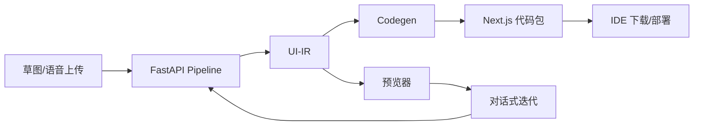

# ProtoWeaver 架构概览

ProtoWeaver 由四个主要层次构成：

1. **采集层**：负责上传与预处理草图、语音。`apps/studio` 的上传面板实现了压缩提示与表单收集。
2. **感知层**：在 `services/api/app/services/pipeline.py` 中模拟 CV/OCR/ASR/NLU 流程，产出布局树与用户意图。
3. **对齐层**：将多模态结果统一到 UI-IR（`packages/ui-ir` 定义），便于后续代码映射与对话式迭代。
4. **代码生成层 + 预览层**：`services/codegen` 将 UI-IR 渲染为 Next.js/Tailwind 代码；`apps/preview` 提供轻量预览器，`apps/studio` 则内嵌代码与 IR 视图。

## 数据流

## UI-IR

- 结构化 JSON Schema，描述组件、属性、布局、事件、主题。
- 支持增量 Patch（`applyPatch`, `applyPatches`）。
- TypeScript 与 Python 双栈共享模型，便于服务间通信。

## 代码生成

- 默认输出 Next.js App Router + Tailwind。
- 可切换到 `framework: 'react'` 生成纯 React/Vite 模板。
- 通过 `services/codegen` 中的简单 renderer 示例演示 AST-free 生成方式。

## 迭代与学习

- `iteration` 端点根据自然语言指令更新 UI-IR 并触发重新生成。
- 可将用户操作记录到 `data/`，进一步用于模型微调。
